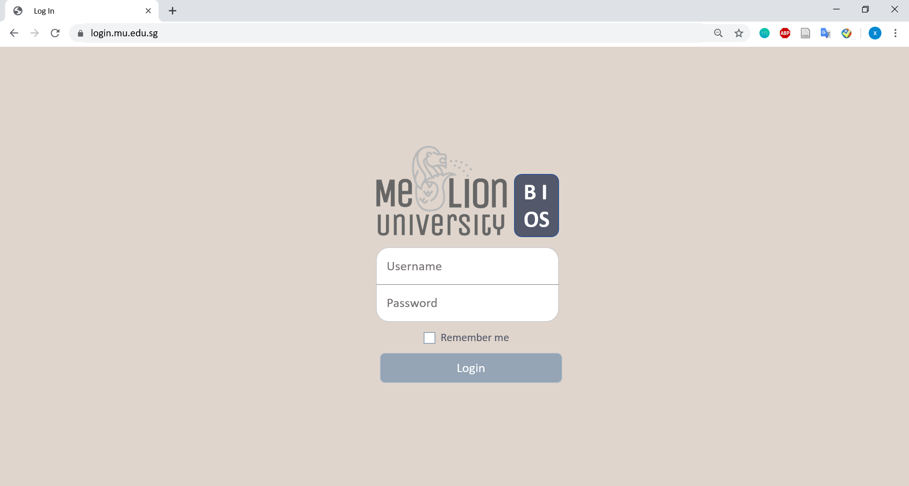

# Login
## Timeline

| Stage        | Status                                                 | Planned Duration  | Changes |
| ------------ | ------------------------------------------------------ | ----------------- | ------- |
| PRD          |  | 1 Sept- 6 Sept    |         |
| Developement |  | 9 Sept - 10 Sept  |         |
| QA           |  | 11 Sept - 11 Sept |         |
| UAT          |  | 12 Sept - 12 Sept |         |
| Release      |  | 13 Sept - 13 Sept |         |

## Tickets
### Task
| Name                                 | Status                                                 | Start Date | End Date | Developer 1 | Developer 2 | QA  |
| ------------------------------------ | ------------------------------------------------------ | ---------- | -------- | ----------- | ----------- | --- |
| [Login] Logo                         |  |            |          |             |             |     |
| [Login] Username and Password fields |  |            |          |             |             |     |
| [Login] Submit button                |  |            |          |             |             |     |
| [Login] Authentication API           |  |            |          |             |             |     |
| [Login] Implement Authentication API |  |            |          |             |             |     |

### Bug
| Name | Status | Start Date | End Date | Developer 1 | Developer 2 | QA  |
| ---- | ------ | ---------- | -------- | ----------- | ----------- | --- |
|      |        |            |          |             |             |     |

## Background
- Login
  - Student
    - A student will log in with his/her email ID and password.
    - Upon success, the student should be able to see the balance e$ along with a welcome message.
    - Upon failure, the app outputs a proper error message and requests the user to login again.
  - Admin
    - An administrator will log in with the username "admin" and password
    - The admin will login from the same login page as student users.
    - (inference) An admin will log in into a dashboard
    - Failure will follow the same case as Student

## Data Flow

## Mockup

## Icons

## Flow
## Flow

## Assignments
- Project Manager:
- Pair programming:
  | Driver  | Observer |
  | ------- | -------- |
  | Xin Pin | Nicolas  |
  | Trevor  | Xuan Lin |
  | Jason   | Nicolas  |